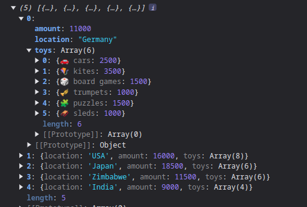
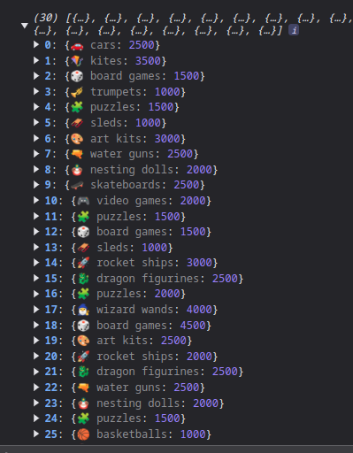
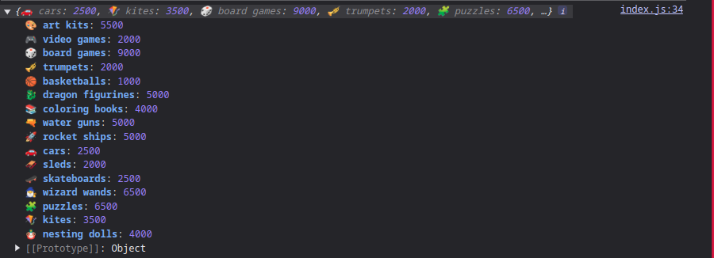
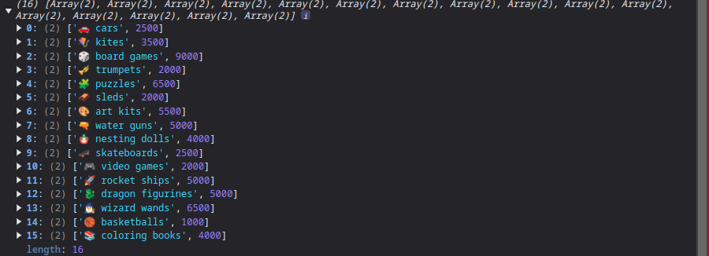

This competition was crazy and full of learning.

we start we the toysRequested object :



where the toys are combined in location, and with the toysRequested.flatMap(location => location.toys); we can achive data resolution and then get it all the data together and counting all toys of same type together
for me is like an reduce with counting the accumulator is a nice to know how(). thanks scrimba. 


Then we just used a reduce method to learn how many toys are for one type of object.keys --> value.
```
    const toyCounts = allToys.reduce((acc, toy) => {
    const toyType = Object.keys(toy)[0];
    const toyCount = toy[toyType];

    acc[toyType] = (acc[toyType] || 0) + toyCount;
    return acc;
}, {});

console.log(toyCounts);

```




And thereafter we just have to find the most popular toy and how we gonna do that ? 

First let's break down the code:

```
const mostPopularToy = Object.entries(toyCounts).reduce((a, b) => (a[1] > b[1] ? a : b))
```

1. Object.entries(toyCounts)
    . This part converts the toyCounts object into an array key-value pairs. Each element of this array is an array itself, where the first element is the key (toy type) and the second element is the corresponding count. 



2. reduce((a, b) => (a[1] > b[1] ? a : b))
    This part uses the reduce() method to iterate over the array of key-value pairs.
    a represents the accumulator, which stats with the first element of the array.
    (a[1] > b[1] ? a : b) is a ternary operator returns a, meaning the current maximum remains unchanged.
    If b[1] is greater, the ternary operator returns b, meaning the current maximum is updated to b.

    ## Why you can't change a[1] a[3]

- Array Indexing: In JavaScript, array indices start from 0. So, a[0] refers to the first element of the array, a[1] refers to the second element, and so on.
- Data  structure: Each element in the Object.entries(toyCounts) array itself an array with two elements:

    - [0]: The toy type
    - [1]:The count of the toy(value).

- Acessing count: To compare the counts of the toys, we need to access the second element of each inner array, which is the count. That's why we use a[1] and b[1].

If you were to use a[3], you would be trying to access an element that doesn't exist in the inner arrays, leading to undefined behavior. 

#### In summary :
- The code iterate through the array of key-value pairs and compares the counts of the toys. It keeps track of the pair with the highest count using reduce() method, ultimately determining the most popular toy. 